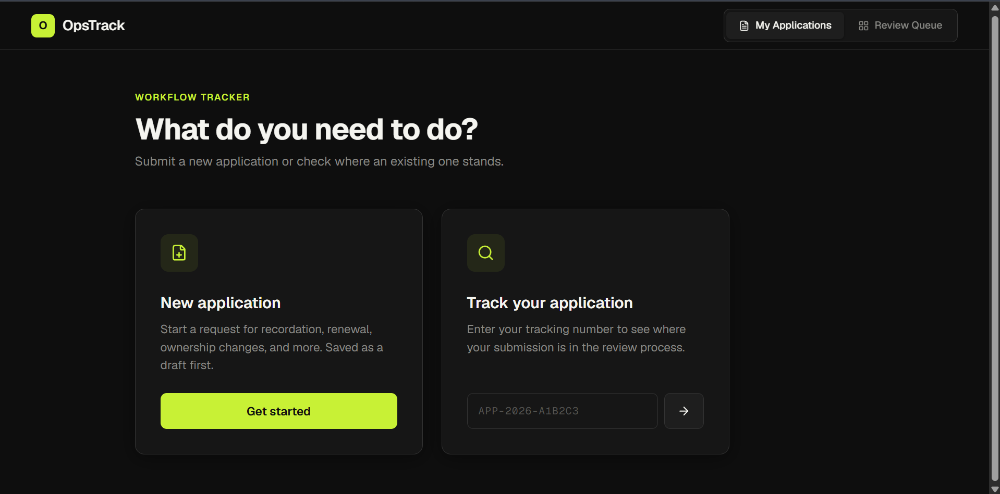
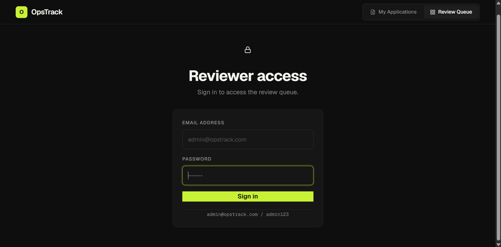
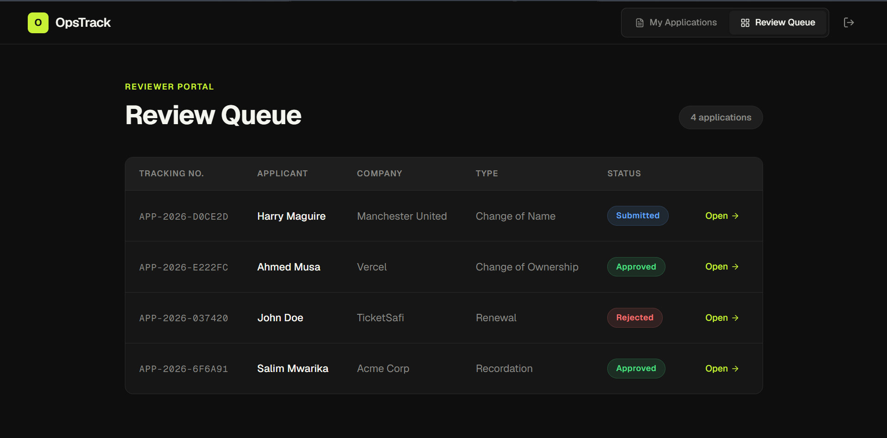
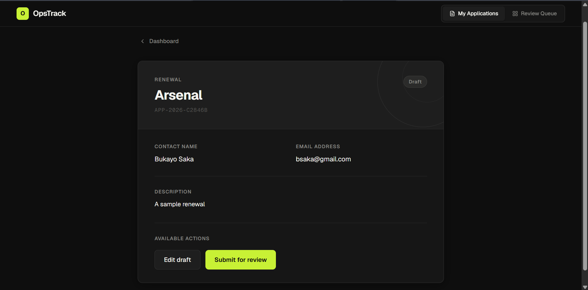
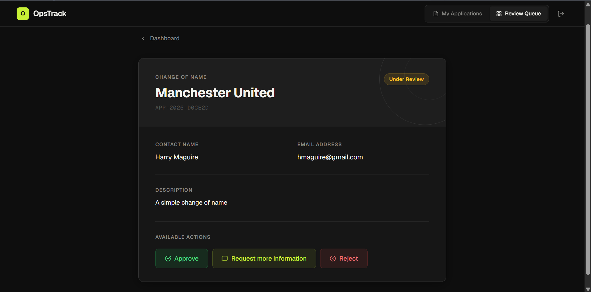
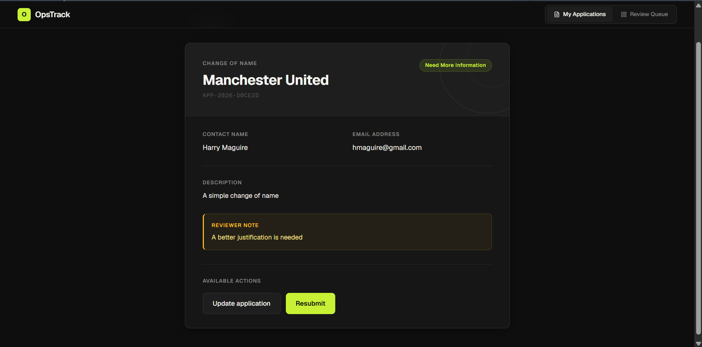

# OpsTrack: Application Workflow Tracker

A full-stack workflow tracking application built to manage a strict state-machine lifecycle for organizational applications. It enforces business rules (e.g., preventing edits to an 'Approved' application) using a Django backend API and a modern React/Vite frontend.

---

## ⚠️ Disclaimer: The "Mock Auth" Architecture

To keep the scope of this assignment focused and simple, I avoided over-engineering a full JWT/Session authentication system on the backend. The Django API relies purely on **strict state-machine validation** to prevent illegal actions.

However, to demonstrate how UI state management and Role-Based Access Control (RBAC) work in a real product, I implemented a **Mock Auth** flow on the frontend. The system defaults to the public Applicant view, but toggling to the Reviewer view requires authentication.

**Reviewer Login Credentials:**
* **Email:** `admin@opstrack.com`
* **Password:** `admin123`

---

## 📋 Prerequisites
* **Python:** 3.10+
* **Node.js:** 18+

---

## 🚀 Setup Instructions

### 1. Clone the Repository
```bash
git clone git@github.com:Salimmwatsefu/OpsTrack-Workflow_Assignment.git
cd OpsTrack-Workflow_Assignment
```

### 2. How to run the backend

Open a terminal, navigate to the backend directory, and set up your virtual environment:

```bash
cd backend
python3 -m venv .venv
source .venv/bin/activate
pip install -r requirements.txt
```

### 3. How to run migrations

In the same backend terminal (with your virtual environment activated), initialize the SQLite database:

```bash
python manage.py makemigrations
python manage.py migrate
```

Once migrations are complete, start the server:

```bash
python manage.py runserver
```

### 4. How to run the frontend

Open a **new, separate terminal**, navigate to the frontend directory, install the packages, and start the Vite dev server:

```bash
cd frontend
npm install
npm run dev
```

---

## 🔗 How to Access

Once both servers are running, you can access the different parts of the stack here:

* **Frontend Application:** [http://localhost:5173](http://localhost:5173)
* **Backend API Base:** `http://127.0.0.1:8000/api/applications/`
* **Interactive API Docs (Swagger UI):** [http://127.0.0.1:8000/api/docs](http://127.0.0.1:8000/api/docs)

For a detailed breakdown of the API endpoints, request payloads, and state-machine rules, please see the [Backend API Documentation (api.md)](./api.md).

---

## 🧠 Assumptions Made

1. **Public Tracking Numbers:** I assumed applicants shouldn't need an account just to check their status. The system generates a unique tracking number (e.g., `APP-2026-A1B2C3`) that acts as a key for applicants to view or track their specific submission.
2. **Backend as the Source of Truth:** I assumed UI state can easily be manipulated by a malicious user. Therefore, all workflow rules (like requiring a comment when rejecting an application) are strictly enforced by the Django API, which will return a `400 Bad Request` if an illegal transition is attempted.
3. **Description is the only updatable field after creation.** Contact and company details are locked once an application is created to preserve the integrity of the record. Only the `description` field can be updated — this constraint is enforced at the API level.
4. **Database Simplicity:** I assumed a zero-configuration local setup was preferred, so I used SQLite.

---

## 📈 What I would improve with more time

1. **Real Authentication (RBAC):** Implement proper Django user models. Internal reviewers would log in via OAuth/SSO, and API endpoints would be protected using JWTs or session cookies.
2. **Pagination:** The list endpoint currently returns all applications. With any real volume this would need cursor or page-based pagination to stay performant.
3. **Production Infrastructure:** Swap SQLite for PostgreSQL to handle concurrency, and Dockerize both the frontend and backend for unified deployments.
4. **Audit Logging:** Create an `ApplicationHistory` model to log exactly *who* triggered a state change and *when* it happened for compliance tracking.
5. **Automated Notifications:** Integrate Celery and Redis to fire off asynchronous email alerts to applicants whenever a reviewer updates their status.

---

## 📸 Screenshots

### Applicant Dashboard
The default view. Applicants can start a new application or track an existing one using their tracking number.



---

### Reviewer Login
Toggling to the Reviewer view requires authentication. This is the frontend mock auth gate.



---

### Review Queue
The full list of applications visible to an authenticated reviewer, showing tracking numbers, applicant details, and current status.



---

### Application Detail — Draft
What an applicant sees when viewing their draft. Edit and Submit actions are available at this stage.



---

### Application Detail — Under Review
What a reviewer sees when an application is ready for a decision. Approve, Request More Information, and Reject actions are shown.



---

### Application Detail — Reviewer Note
After a reviewer requests more information, the applicant sees this amber feedback box with the reviewer's comment alongside the Update and Resubmit actions.

